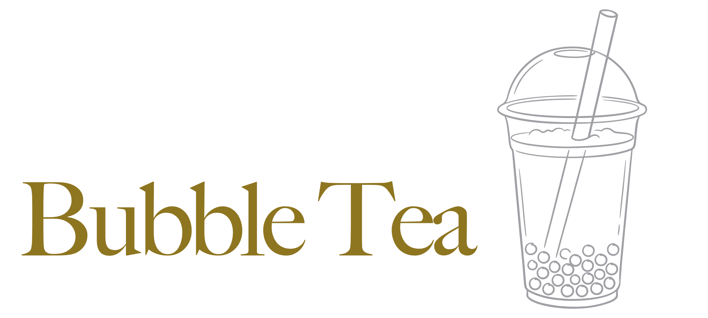

<p>
    <a href="charming_bubbletea.png"></a><br>
    <a href="https://crates.io/crates/charming-bubbletea"></a>
    <a href="https://www.phorm.ai/query?projectId=a0e324b6-b706-4546-b951-6671ea60c13f"></a>
</p>

# Charming Bubble Tea (`charming-bubbletea`)

**Charming Bubble Tea** is a complete, from-scratch Rust port of [Bubble Tea](https://github.com/charmbracelet/bubbletea), the Elm-architecture TUI framework that powers Charmbracelet's terminal apps. It tracks upstream Go releases on a rolling basis — this crate mirrors upstream `v2.0.8` — with a hard goal of **1:1 behavioral and visual parity**: the same messages, commands, and rendering output, favoring fidelity to upstream semantics over Rust-native rewrites whenever the two would diverge.

It's part of the Charming port family of the Bubble Tea ecosystem and builds on [charming-ultraviolet](https://github.com/coderbants/charming-ultraviolet) (terminal renderer & input), [charming-lipgloss](https://github.com/coderbants/charming-lipgloss) (styling), [charming-x-ansi](https://github.com/coderbants/charming-x-ansi) (ANSI primitives), and [charming-colorprofile](https://github.com/coderbants/charming-colorprofile) — with UI components available in [charming-bubbles](https://github.com/coderbants/charming-bubbles).

The fun, functional and stateful way to build terminal apps. A Rust port based on [The Elm Architecture][elm] and upstream [charmbracelet/bubbletea](https://github.com/charmbracelet/bubbletea). Bubble Tea is well-suited for simple and complex terminal applications, either inline, full-window, or a mix of both.

## Installation

```sh
cargo add charming-bubbletea
```

Then build your application around a `charming_bubbletea::Program` — see the [tutorial](#tutorial) below to get started.

<p>
    
</p>

Bubble Tea is in use in production and includes a number of features and performance optimizations. Among those is a framerate-based renderer, mouse support, focus reporting and more.

To get started, see the tutorial below, the [examples][examples], the [docs][docs], the [video tutorials][youtube] and some common [resources](#libraries-we-use-with-bubble-tea).

[youtube]: https://charm.sh/yt

## By the way

Be sure to check out [Bubbles][bubbles], a library of common UI components for Bubble Tea.

<p>
    <a href="https://github.com/coderbants/charming-bubbles"></a>&nbsp;&nbsp;
    <a href="https://github.com/coderbants/charming-bubbles"></a>
</p>

---

## Tutorial

Bubble Tea is based on the functional design paradigms of [The Elm Architecture][elm]. It's a delightful way to build applications.

[elm]: https://guide.elm-lang.org/architecture/
[tut-source]: https://github.com/charmbracelet/bubbletea/tree/main/tutorials/basics

### Enough! Let's get to it.

For this tutorial, we're making a shopping list.

Bubble Tea programs are comprised of a **model** that describes the application state and three simple methods on that model:

- **init**, a function that returns an initial command for the application to run.
- **update**, a function that handles incoming events and updates the model accordingly.
- **view**, a function that renders the UI based on the data in the model.

```rust
use charming_bubbletea::*;

struct Model {
    choices: Vec<String>,
    cursor: usize,
    selected: std::collections::HashSet<usize>,
}

fn initial_model() -> Model {
    let mut selected = std::collections::HashSet::new();
    Model {
        choices: vec!["Buy carrots".to_string(), "Buy celery".to_string(), "Buy kohlrabi".to_string()],
        cursor: 0,
        selected,
    }
}
```

## License

[MIT](LICENSE)
