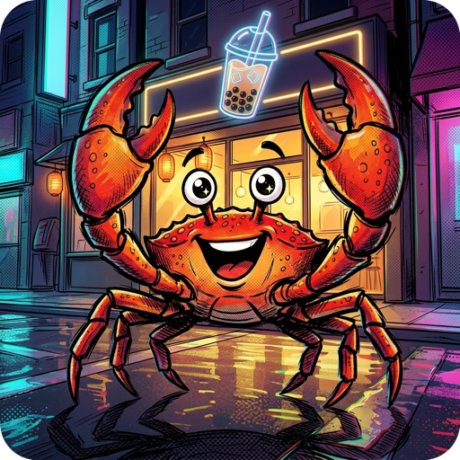

<p align="center">
    <a href="rusty-bubbletea.png"></a><br>
    <a href="https://crates.io/crates/rusty-bubbletea"></a>
    <a href="https://github.com/coderbants/rusty-bubbletea/actions"></a>
    <a href="https://app.codecov.io/gh/coderbants/rusty-bubbletea"></a>

</p>

# Rusty Bubble Tea (`rusty-bubbletea`)

**Rusty Bubble Tea** is a complete, from-scratch Rust port of [Bubble Tea](https://github.com/charmbracelet/bubbletea), the Elm-architecture TUI framework that powers Charmbracelet's terminal apps. It tracks upstream Go releases on a rolling basis. **Version policy: the crate version and every release tag must equal the tracked upstream version exactly — never ahead, never behind** (enforced by `scripts/verify_upstream_version.sh` in CI and on every release). It holds a hard goal of **1:1 behavioural, visual and license parity**: the same messages, commands, and rendering output, favoring fidelity to upstream semantics over Rust-native rewrites whenever the two would diverge.

It's part of the Rusty port family of the Bubble Tea ecosystem and builds on [rusty-ultraviolet](https://github.com/coderbants/rusty-ultraviolet) (terminal renderer & input), [rusty-lipgloss](https://github.com/coderbants/rusty-lipgloss) (styling), [rusty-x-ansi](https://github.com/coderbants/rusty-x-ansi) (ANSI primitives), and [rusty-colorprofile](https://github.com/coderbants/rusty-colorprofile) — with UI components available in [rusty-bubbles](https://github.com/coderbants/rusty-bubbles).

***About Bubble Tea***

The fun, functional and stateful way to build terminal apps. A Rust port based on [The Elm Architecture][elm] and upstream [charmbracelet/bubbletea](https://github.com/charmbracelet/bubbletea). Bubble Tea is well-suited for simple and complex terminal applications, either inline, full-window, or a mix of both.

## Installation

```sh
cargo add rusty-bubbletea
```

Then build your application around a `rusty_bubbletea::Program` — see the [tutorial](#tutorial) below to get started.

<p>
    
</p>

Bubble Tea is in use in production and includes a number of features and performance optimizations. Among those is a framerate-based renderer, mouse support, focus reporting and more.

To get started, see the tutorial below, the [examples][examples], the [docs][docs], the [video tutorials][youtube] and some common [resources](#libraries-we-use-with-bubble-tea).

[youtube]: https://charm.sh/yt

## By the way

Be sure to check out [Bubbles][bubbles], a library of common UI components for Bubble Tea.

<p>
    <a href="https://github.com/coderbants/rusty-bubbles"></a>&nbsp;&nbsp;
    <a href="https://github.com/coderbants/rusty-bubbles"></a>
</p>

---

## Tutorial

Bubble Tea is based on the functional design paradigms of [The Elm Architecture][elm]. It's a delightful way to build applications.

[elm]: https://guide.elm-lang.org/architecture/
[tut-source]: https://github.com/charmbracelet/bubbletea/tree/main/tutorials/basics

### Enough! Let's get to it.

For this tutorial, we're making a shopping list.

Bubble Tea programs are comprised of a **model** that describes the application state and three simple methods on that model:

- **init**, a function that returns an initial command for the application to run.
- **update**, a function that handles incoming events and updates the model accordingly.
- **view**, a function that renders the UI based on the data in the model.

```rust
use rusty_bubbletea::model::Model as ModelTrait;
use rusty_bubbletea::{quit, Cmd, KeyPressMsg, Msg, Program, View};
use std::collections::HashSet;

struct Model {
    choices: Vec<String>,
    cursor: usize,
    selected: HashSet<usize>,
}

impl ModelTrait for Model {
    // The initial command. We don't need to kick off anything, so return None.
    fn init(&self) -> Cmd {
        None
    }

    // Handle incoming events. Key presses move the cursor, toggle a choice,
    // or quit.
    fn update(&mut self, msg: &dyn Msg) -> Cmd {
        if let Some(k) = msg.as_any().downcast_ref::<KeyPressMsg>() {
            match k.0.to_string().as_str() {
                "j" | "down" => self.cursor = (self.cursor + 1).min(self.choices.len() - 1),
                "k" | "up" => self.cursor = self.cursor.saturating_sub(1),
                "enter" | " " => {
                    if !self.selected.insert(self.cursor) {
                        self.selected.remove(&self.cursor);
                    }
                }
                "q" | "ctrl+c" => return quit(),
                _ => {}
            }
        }
        None
    }

    // Render the current state to a View. Build a plain string and wrap it.
    fn view(&self) -> View {
        let mut s = String::from("What should we buy at the market?\n\n");
        for (i, choice) in self.choices.iter().enumerate() {
            let cursor = if self.cursor == i { ">" } else { " " };
            let checked = if self.selected.contains(&i) { "x" } else { " " };
            s.push_str(&format!("{cursor} [{checked}] {choice}\n"));
        }
        s.push_str("\nPress q to quit.\n");
        View::new(&s)
    }
}

fn main() -> Result<(), Box<dyn std::error::Error>> {
    let model = Model {
        choices: vec![
            "Buy carrots".to_string(),
            "Buy celery".to_string(),
            "Buy kohlrabi".to_string(),
        ],
        cursor: 0,
        selected: HashSet::new(),
    };
    let program = Program::new(model);
    program.run()?;
    Ok(())
}
```

Save that to `main.rs` and run it with `cargo run`:

- **j/k** or the arrow keys move the cursor up and down.
- **enter** or **space** toggles an item on and off the list.
- **q** or **ctrl+c** quits.

That's it — the three methods of the [Elm Architecture][elm] are all you need. The `Msg` type is a trait object, so your `update` downcasts the messages you care about (keys, mouse, window size, timers, and any custom messages you define) and ignores the rest. `View` is a declarative description of the frame — plain text plus optional cursor, alt-screen, and mouse-mode settings — which the renderer diffs against the previous frame to produce minimal terminal output.

From here, the best next step is to browse the [examples][examples] directory — every upstream Bubble Tea example is ported there and each one is verified byte-for-byte against the Go build by the E2E harness. For common UI components such as text inputs, spinners and lists, see [rusty-bubbles][bubbles].

## License

[MIT](LICENSE)
